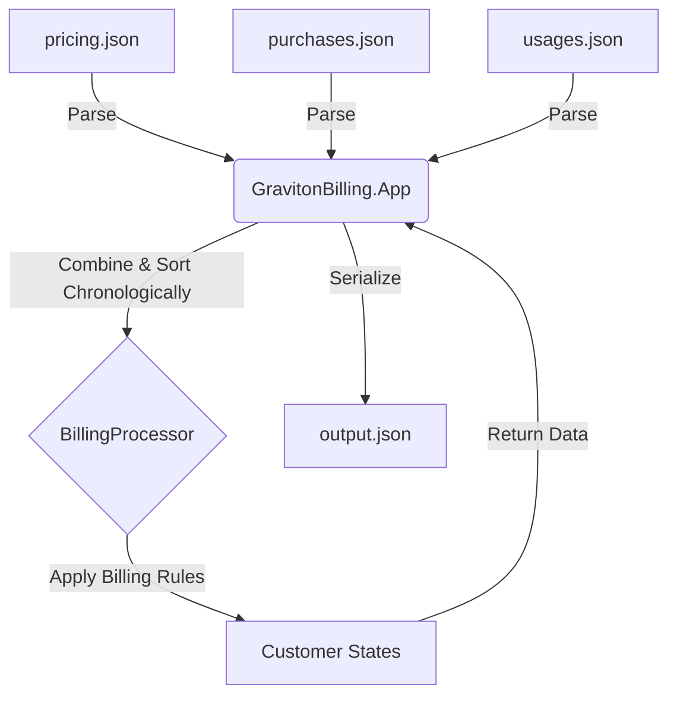
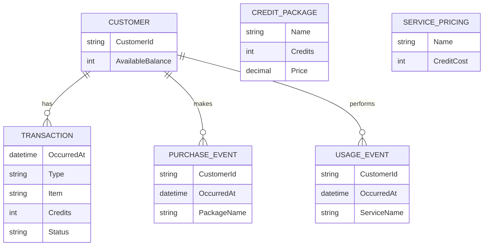
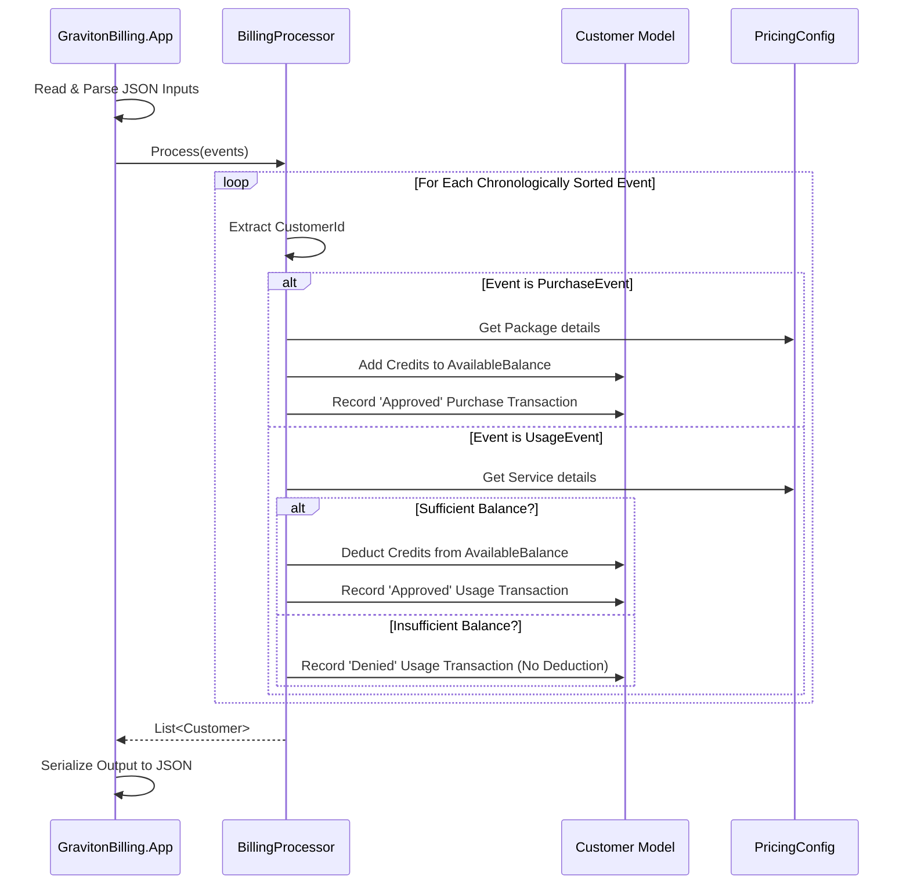

# Thought Process

## 1. Domain Modeling
I modeled the entities (`Customer`, `ServicePricing`, `CreditPackage`, `PurchaseEvent`, `UsageEvent`, `Transaction`) separately from any file input/output concerns. This allows the core billing logic to be entirely decoupled from JSON serialization and console application specifics. The output combines a customer's `AvailableBalance` alongside an explicit log of their `Transactions`.

## 2. Chronological Processing (Event Sourcing lite)
To accurately deny usage when a customer runs out of credits, it's crucial to process purchases and usage in chronological order. I introduced an `OccurredAt` timestamp to the input files. The `BillingProcessor` combines purchases and usages into a single stream of `BaseEvent`, sorts them by this timestamp, and then processes them sequentially. This mimics a lightweight event-sourcing model and guarantees the correct state is calculated at any given time.

## 3. Technology Choices
- **.NET 8.0**: Latest LTS version of .NET.
- **System.Text.Json**: To adhere strictly to the rule "DO NOT USE any other libraries or frameworks", I selected JSON for all file formats because .NET Core has built-in parsing (`System.Text.Json`). If I used CSV, I would either have to write my own parser (violating the "don't reinvent the wheel / clean code" spirit) or use `CsvHelper` (violating the no 3rd party library rule).
- **xUnit**: For testing, as it's the standard .NET testing framework and is not a business logic library.

## 4. Design Decisions
- **Denied Transactions (Insufficient Balance)**: For usages that exceed a customer's available balance, I log the transaction with the actual cost amount (e.g. `-2` credits) and mark the `Status` as `Denied`. I skip deducting this cost from the balance. This ensures maximum visibility into attempted usage without incorrectly driving the customer's balance negative.
- **Graceful Error Handling (Invalid Items)**: If a customer requests a package or service that isn't defined in `pricing.json`, the transaction is skipped and marked as `Denied` with a `0` credit value. This prevents the system from crashing on invalid references while still providing an audit trail.
- **Clean Architecture Principles**: The solution is split into three projects (`Core`, `App`, `Tests`). `Core` has zero dependencies and only contains pure domain logic and models. `App` handles IO, parsing, and console orchestration. This demonstrates good separation of concerns and appropriate abstraction without over-engineering.

## 5. System Diagrams

### Data Flow Diagram
This diagram illustrates how data flows from the raw JSON inputs, through the Core processing logic, and out to the final output file.



### Entity-Relationship (ER) Diagram
This diagram shows the relationship between the core entities within the domain model.



### Use Case Diagram
This diagram outlines the primary use cases supported by the system from an external actor's perspective.

```mermaid
flowchart LR
    actor User
    subgraph Graviton Billing System
        UC1(Read Pricing & Event Data)
        UC2(Process Purchase)
        UC3(Process Usage)
        UC4(Generate Billing Output)
    end
    User --> UC1
    User --> UC4
    UC1 --> UC2
    UC1 --> UC3
```

### Sequence Diagram
This diagram details the sequence of operations for evaluating events inside the `BillingProcessor`.


