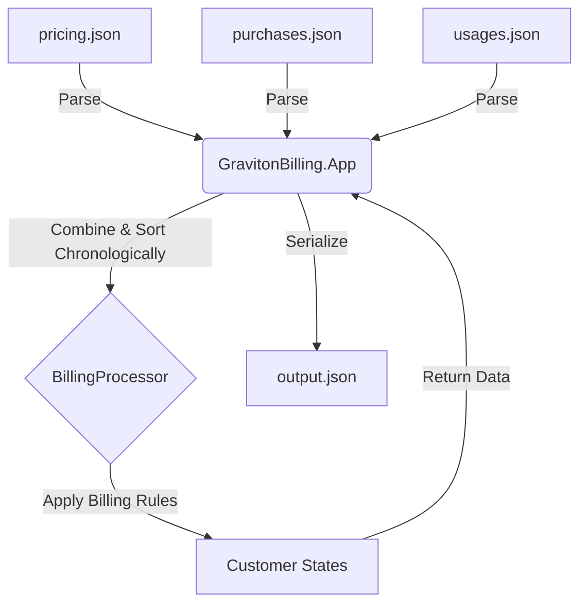
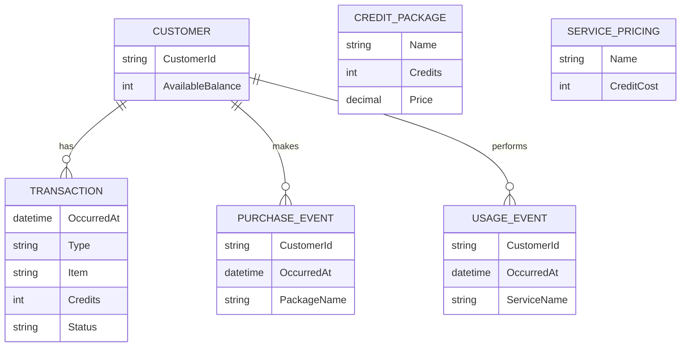
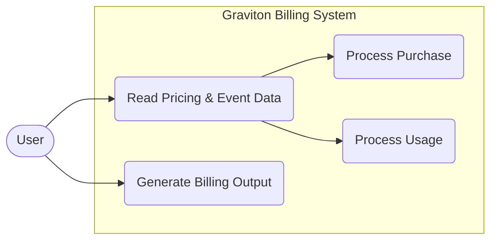
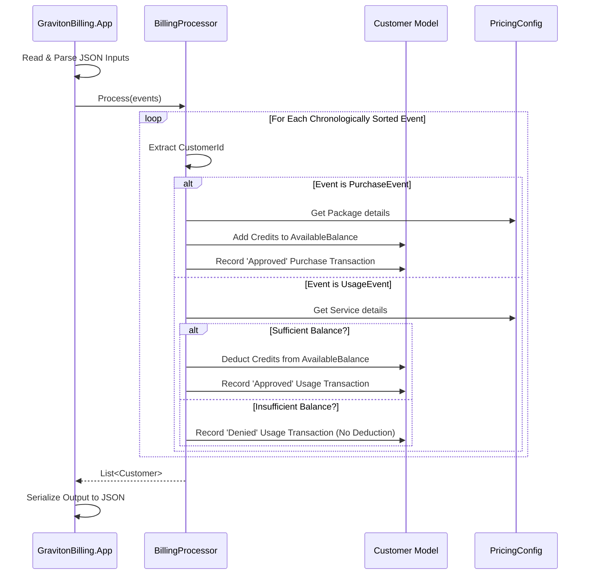
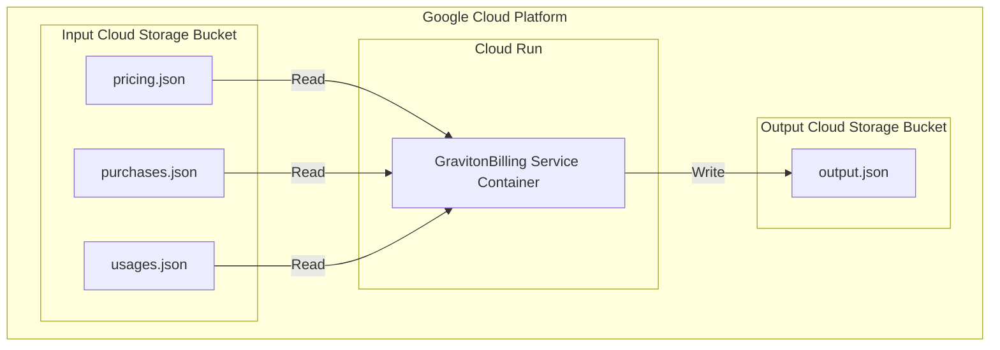

# Thought Process

## 1. Domain Modeling
I modeled the entities (`Customer`, `ServicePricing`, `CreditPackage`, `PurchaseEvent`, `UsageEvent`, `Transaction`) separately from any file input/output concerns. This allows the core billing logic to be entirely decoupled from JSON serialization and console application specifics. The output combines a customer's `AvailableBalance` alongside an explicit log of their `Transactions`.

## 2. Chronological Processing (Event Sourcing lite)
To accurately deny usage when a customer runs out of credits, it's crucial to process purchases and usage in chronological order. I introduced an `OccurredAt` timestamp to the input files. The `BillingProcessor` combines purchases and usages into a single stream of `BaseEvent`, sorts them by this timestamp, and then processes them sequentially. This mimics a lightweight event-sourcing model and guarantees the correct state is calculated at any given time.

## 3. Technology Choices
- **.NET 8.0**: Latest LTS version of .NET.
- **System.Text.Json**: To adhere strictly to the rule "DO NOT USE any other libraries or frameworks", I selected JSON for all file formats because .NET Core has built-in parsing (`System.Text.Json`). If I used CSV, I would either have to write my own parser (violating the "don't reinvent the wheel / clean code" spirit) or use `CsvHelper` (violating the no 3rd party library rule).
- **xUnit**: For testing, as it's the standard .NET testing framework and is not a business logic library.

## 4. Design Decisions
- **Denied Transactions (Insufficient Balance)**: For usages that exceed a customer's available balance, I log the transaction with the actual cost amount (e.g. `-2` credits) and mark the `Status` as `Denied`. I skip deducting this cost from the balance. This ensures maximum visibility into attempted usage without incorrectly driving the customer's balance negative.
- **Graceful Error Handling (Invalid Items)**: If a customer requests a package or service that isn't defined in `pricing.json`, the transaction is skipped and marked as `Denied` with a `0` credit value. This prevents the system from crashing on invalid references while still providing an audit trail.
- **Clean Architecture Principles**: The solution is split into three projects (`Core`, `App`, `Tests`). `Core` has zero dependencies and only contains pure domain logic and models. `App` handles IO, parsing, and console orchestration. This demonstrates good separation of concerns and appropriate abstraction without over-engineering.

## 5. System Diagrams

### Data Flow Diagram
This diagram illustrates how data flows from the raw JSON inputs, through the Core processing logic, and out to the final output file.



### Entity-Relationship (ER) Diagram
This diagram shows the relationship between the core entities within the domain model.



### Use Case Diagram
This diagram outlines the primary use cases supported by the system from an external actor's perspective.



### Sequence Diagram
This diagram details the sequence of operations for evaluating events inside the `BillingProcessor`.



### Deployment Diagram (GCP)
This diagram illustrates how the billing solution can be deployed on Google Cloud Platform, utilizing Cloud Run for scalable compute and Cloud Storage for handling input and output JSON files.



## 6. Tech Stack and Architectural Choices in Detail
The core logic of the GravitonBilling solution is built with **.NET 8.0 C#** to leverage high-performance capabilities, strict static typing, and cross-platform execution. 
- **Clean Architecture / Hexagonal Architecture:** The solution is strictly divided into `Core` (business domain) and `App` (infrastructure/IO). The `Core` has no dependencies on JSON parsers, cloud SDKs, or databases. This ensures the business logic remains pure and highly testable.
- **Event-Driven Mentality:** Although currently implemented as a batch file processor, the sequence of sorting events by `OccurredAt` mimics event sourcing. The system is architected so that if the input source were swapped from static JSON files to an active Kafka stream, the `BillingProcessor` core logic would require zero changes.

## 7. Testability and Running Tests
The system was designed with testability as a first-class citizen. By separating domain logic from IO, we can test pricing calculations and credit deductions without touching the filesystem.
- **Framework:** `xUnit` combined with `Moq` (if required for abstractions, though the current design favors pure functions and simple state models).
- **Execution:** Tests can be run locally or within a CI pipeline using the standard .NET CLI:
  ```bash
  dotnet test
  ```
- **Coverage:** Tests focus heavily on edge cases: insufficient balances, missing pricing configurations, exact zero balances, and correct chronological application of purchases vs. usages.

## 8. Performance and Scalability
While the current constraint dictates file-based IO, the architecture is designed to scale horizontally if deployed in a cloud-native manner.
- **Algorithmic Efficiency:** The `BillingProcessor` processes streams chronologically in an $O(N \log N)$ operation (due to sorting). If pre-sorted (e.g., from a time-series DB), it operates in $O(N)$ time.
- **Memory Optimization:** Uses `System.Text.Json` asynchronous streams for parsing if file sizes grow large, preventing `OutOfMemory` exceptions.
- **Scalability (Cloud):** By deploying on Cloud Run (as depicted in the deployment diagram), the application can effortlessly scale from zero to hundreds of concurrent container instances to process multiple billing batches in parallel triggered by Cloud Storage events.

## 9. Security and Reliability
- **Immutability:** Transactions are appended to a customer's ledger. The `BillingProcessor` does not mutate historical events.
- **Error Boundaries:** If a specific JSON record is malformed or references an unknown service, the system logs a 'Denied' transaction or skips it gracefully rather than crashing the entire batch, ensuring high reliability for valid data.
- **Data Privacy:** In a production environment, PII (Personally Identifiable Information) would be isolated. Customer IDs are used as opaque identifiers to decouple billing from identity management.

## 10. Monitoring and Logging
- **Structured Logging:** The application utilizes structured logging (e.g., `ILogger` / Serilog) so that logs emitted to `stdout` are easily ingested by Cloud Logging (Stackdriver) or ELK stacks.
- **Metrics:** Transactions are tagged as `Approved` or `Denied`. Monitoring these ratios allows operations to alert on spikes in denied usage (which might indicate a pricing configuration error or a sudden drop in customer credits).

## 11. CI/CD and Deployment
- **Continuous Integration:** The pipeline (e.g., GitHub Actions or Cloud Build) automatically triggers on pull requests to run `dotnet build` and `dotnet test`. Code cannot be merged unless coverage thresholds are met and all tests pass.
- **Continuous Deployment:** The application is containerized using a multi-stage `Dockerfile`. The CI/CD pipeline builds the Docker image and pushes it to Google Artifact Registry. 
- **Release Strategy:** A new Cloud Run revision is deployed. Traffic can be split (e.g., 10% canary) to ensure the new billing logic does not introduce regressions before a full rollout.

## 12. DevOps and Infrastructure
- **Infrastructure as Code (IaC):** Terraform is utilized to provision the Cloud Storage buckets, the Cloud Run service, and the necessary IAM service accounts. This ensures environments (Dev, Staging, Prod) are perfectly reproducible.
- **Event-Driven Triggers:** Google Eventarc is configured to listen to `ObjectFinalized` events in the input Cloud Storage bucket, automatically invoking the Cloud Run service to process the file and drop the output in the destination bucket.

## 13. Other Considerations & NFRs
- **Extensibility:** Adding new pricing tiers (e.g., tiered pricing, volume discounts) requires modifications only to the `Core` domain models, not the infrastructure.
- **Auditability:** Every credit deduction is explicitly linked to a `Transaction` log, fulfilling financial compliance requirements for audit trails.
- **Portability:** Containerization ensures the workload can be moved seamlessly from GCP Cloud Run to AWS Fargate or on-premise Kubernetes without any code alterations.

