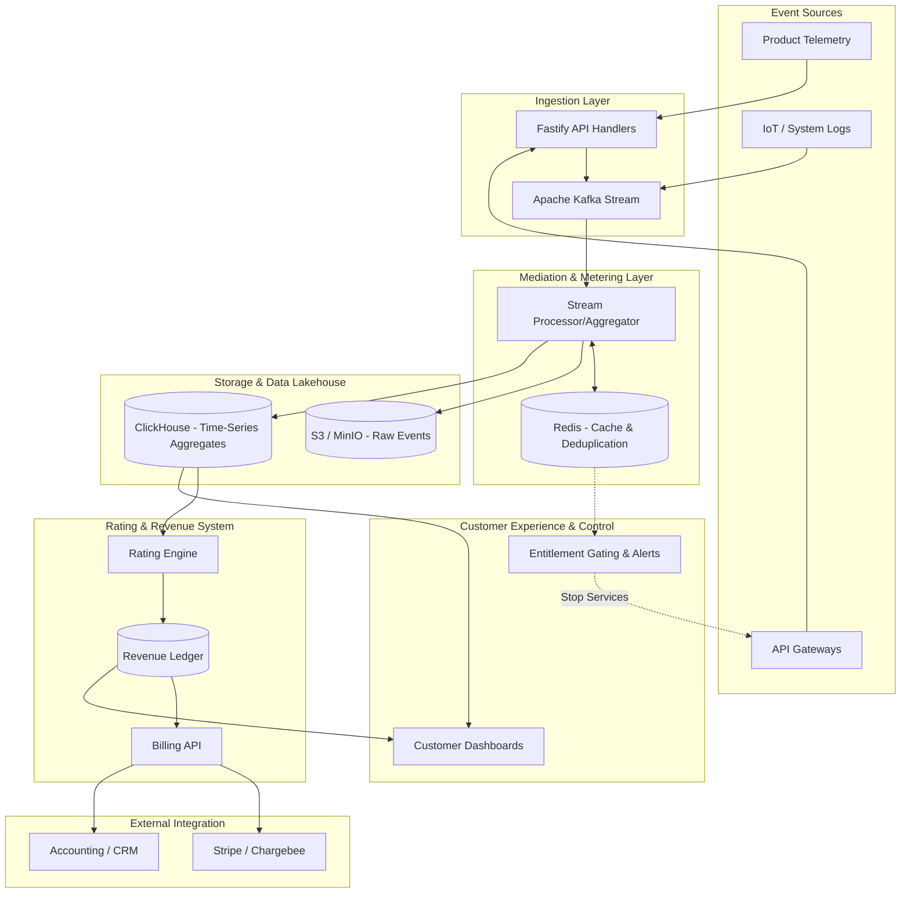
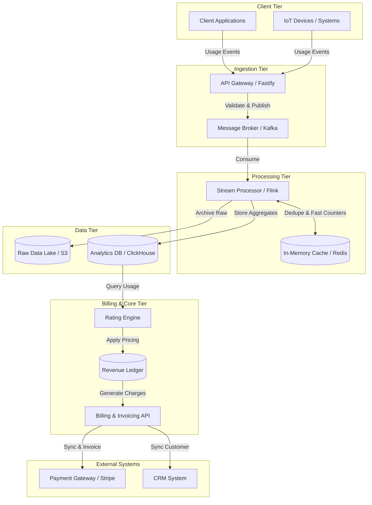

# Usage-Based Billing Reference Architecture

## 1. Overview
This reference architecture describes a highly scalable, real-time usage-based billing platform. Unlike traditional flat-fee subscriptions, this system is designed to handle high-volume event streams (e.g., millions of events per second), process them accurately without data loss or duplication, and calculate metered charges dynamically. 

The architecture follows a decoupled, event-driven pattern that separates raw usage ingestion from the rating and invoicing processes, supporting complex pricing structures, rapid iteration, and real-time customer transparency.

## 2. System Diagrams

### 2.1 Architecture Overview Diagram

### 2.2 Component Diagram

### 2.3 Use Case Diagram

## 3. Core Components

### 3.1. Ingestion Layer
*   **Event Ingestion / Instrumentation:** Captures raw usage events (API calls, bytes processed, compute hours) in real-time. Built to handle massive throughput (up to 100k+ events/sec).
*   **Technologies:** Fastify (for high-performance API endpoints), Apache Kafka (for durable, scalable event streaming).

### 3.2. Mediation & Metering Layer
*   **Mediation:** Responsible for collecting, validating, cleansing, and deduplicating events. Ensures idempotent operations by checking unique request IDs so duplicate network retries do not lead to double billing.
*   **Aggregation:** Processes high-volume raw events into billable metrics (e.g., summing GBs or counting API calls).
*   **Technologies:** Redis is utilized as an in-memory fast-path for deduplication, state tracking, and real-time counters.

### 3.3. Storage & Data Lakehouse
*   **Raw Event Storage (Data Lake):** Stores immutable, raw events for auditing and historical back-processing without schema lock-in. 
*   **Analytical Storage (Data Warehouse):** Stores aggregated time-series data optimized for fast querying by the Rating Engine and Customer Dashboards.
*   **Technologies:** Amazon S3 / MinIO (Raw Object Storage), ClickHouse (High-performance Time-Series Database).

### 3.4. Rating & Revenue System
*   **Rating Engine:** Applies complex business rules, tier-based pricing, volume discounts, and hybrid billing logic to the aggregated consumption data.
*   **Revenue Ledger:** A highly available, accurate financial record system that maintains customer balances, manages credits, and supports complex pricing structures.
*   **Billing & Invoicing API:** Acts as the interface to generate formalized charges.

### 3.5. Customer Experience & Control
*   **Entitlement Gating & Alerts:** Uses the fast-path (Redis) to enforce quotas, trigger real-time alerts before a cap is hit, or circuit-break services when funds run out.
*   **Customer Usage Dashboards:** APIs that provide customers with complete transparency over their consumption, spend, and commitment burndowns.

### 3.6. External Integration
*   **Billing Systems:** Finalized charges are pushed to external systems for actual payment collection, invoicing, and compliance.
*   **Technologies:** Stripe, Chargebee.

## 4. Architectural Patterns Used

1.  **Event-Driven Pipeline:** Data flows continuously via Kafka, processing events asynchronously to maintain system responsiveness and near real-time dashboards.
2.  **Decoupled Architecture:** Separates the metering layer from the billing layer. Raw events are completely separated from pricing logic.
3.  **Data Lakehouse Pattern:** Combines the scalability of S3 with the structured analytical power of ClickHouse.
4.  **Idempotency & Resilience:** Guarantees that late-arriving or duplicate events are handled seamlessly without causing revenue leakage or overcharging.
5.  **Product-Centric Billing:** Usage constraints and live costs are tied directly into the product interface for real-time personalization.

## 5. Key Considerations

*   **Performance & Scalability:** Designed to process millions of events gracefully, essential for high-throughput domains like LLMs/AI, IoT, and heavy API usage.
*   **Accuracy:** Robust infrastructure handles delayed events ("late-arriving" events) and ensures the Revenue Ledger is fundamentally accurate for compliance and accounting standard revenue recognition.
*   **Flexibility:** "No schema lock-in" approach allows raw capture, meaning pricing models can pivot easily (e.g., moving from per-seat to per-token pricing) without needing to change how usage is instrumented.
