# Usage-Based Billing Reference Architecture

## 1. Overview
This reference architecture describes a highly scalable, real-time usage-based billing platform. Unlike traditional flat-fee subscriptions, this system is designed to handle high-volume event streams (e.g., millions of events per second), process them accurately without data loss or duplication, and calculate metered charges dynamically. 

The architecture follows a decoupled, event-driven pattern that separates raw usage ingestion from the rating and invoicing processes, supporting complex pricing structures, rapid iteration, and real-time customer transparency.

## 2. System Diagrams

### 2.1 Architecture Overview Diagram

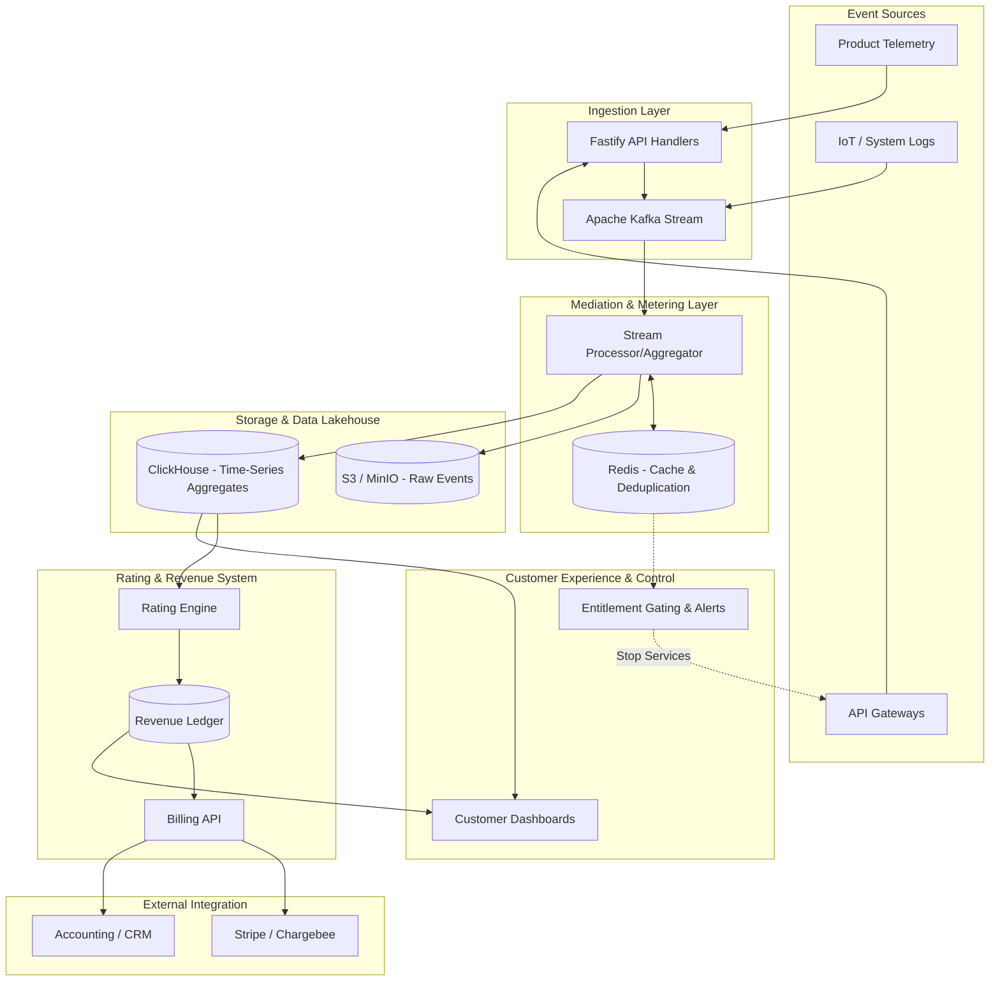

### 2.2 Component Diagram

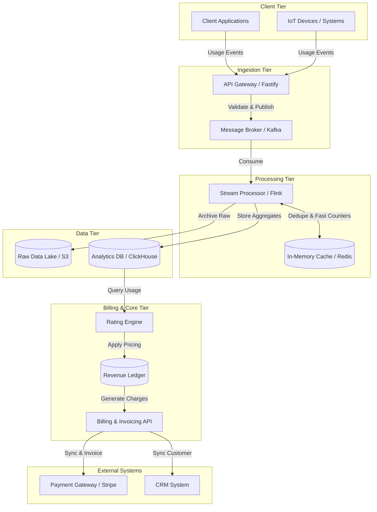

### 2.3 Use Case Diagram

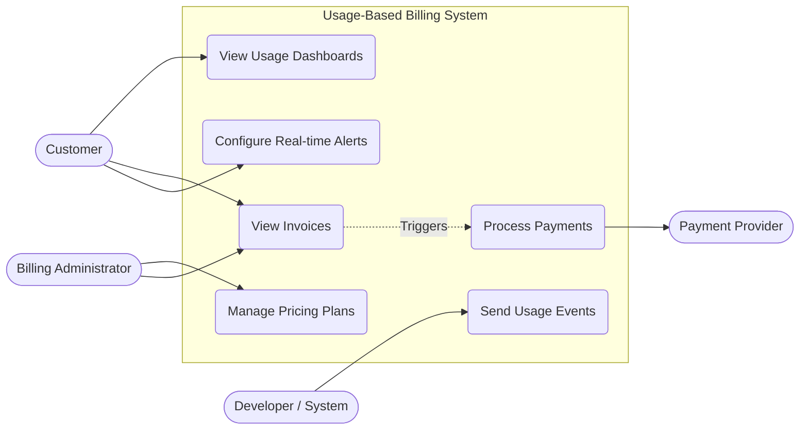

### 2.4 Domain and Sub-Domain Diagram

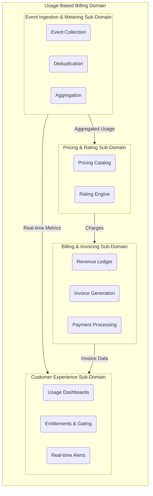

## 3. Core Components

### 3.1. Ingestion Layer
*   **Event Ingestion / Instrumentation:** Captures raw usage events (API calls, bytes processed, compute hours) in real-time. Built to handle massive throughput (up to 100k+ events/sec).
*   **Technologies:** Fastify (for high-performance API endpoints), Apache Kafka (for durable, scalable event streaming).

### 3.2. Mediation & Metering Layer
*   **Mediation:** Responsible for collecting, validating, cleansing, and deduplicating events. Ensures idempotent operations by checking unique request IDs so duplicate network retries do not lead to double billing.
*   **Aggregation:** Processes high-volume raw events into billable metrics (e.g., summing GBs or counting API calls).
*   **Technologies:** Redis is utilized as an in-memory fast-path for deduplication, state tracking, and real-time counters.

### 3.3. Storage & Data Lakehouse
*   **Raw Event Storage (Data Lake):** Stores immutable, raw events for auditing and historical back-processing without schema lock-in. 
*   **Analytical Storage (Data Warehouse):** Stores aggregated time-series data optimized for fast querying by the Rating Engine and Customer Dashboards.
*   **Technologies:** Amazon S3 / MinIO (Raw Object Storage), ClickHouse (High-performance Time-Series Database).

### 3.4. Rating & Revenue System
*   **Rating Engine:** Applies complex business rules, tier-based pricing, volume discounts, and hybrid billing logic to the aggregated consumption data.
*   **Revenue Ledger:** A highly available, accurate financial record system that maintains customer balances, manages credits, and supports complex pricing structures.
*   **Billing & Invoicing API:** Acts as the interface to generate formalized charges.

### 3.5. Customer Experience & Control
*   **Entitlement Gating & Alerts:** Uses the fast-path (Redis) to enforce quotas, trigger real-time alerts before a cap is hit, or circuit-break services when funds run out.
*   **Customer Usage Dashboards:** APIs that provide customers with complete transparency over their consumption, spend, and commitment burndowns.

### 3.6. External Integration
*   **Billing Systems:** Finalized charges are pushed to external systems for actual payment collection, invoicing, and compliance.
*   **Technologies:** Stripe, Chargebee.

## 4. Architectural Patterns Used

1.  **Event-Driven Pipeline:** Data flows continuously via Kafka, processing events asynchronously to maintain system responsiveness and near real-time dashboards.
2.  **Decoupled Architecture:** Separates the metering layer from the billing layer. Raw events are completely separated from pricing logic.
3.  **Data Lakehouse Pattern:** Combines the scalability of S3 with the structured analytical power of ClickHouse.
4.  **Idempotency & Resilience:** Guarantees that late-arriving or duplicate events are handled seamlessly without causing revenue leakage or overcharging.
5.  **Product-Centric Billing:** Usage constraints and live costs are tied directly into the product interface for real-time personalization.

## 5. Key Considerations

*   **Performance & Scalability:** Designed to process millions of events gracefully, essential for high-throughput domains like LLMs/AI, IoT, and heavy API usage.
*   **Accuracy:** Robust infrastructure handles delayed events ("late-arriving" events) and ensures the Revenue Ledger is fundamentally accurate for compliance and accounting standard revenue recognition.
*   **Flexibility:** "No schema lock-in" approach allows raw capture, meaning pricing models can pivot easily (e.g., moving from per-seat to per-token pricing) without needing to change how usage is instrumented.

## 6. Implementation Details: Ingestion Layer

### 6.1 Overview
The **Ingestion Layer** is the entry point for all usage data. It must be highly performant, resilient, and capable of buffering large volumes of events before they are persisted or processed by the downstream metering engine.

### 6.2 Technology Choices
* **Framework:** **Node.js with Fastify**. Fastify is chosen for its extremely low overhead, fast routing, and high throughput capabilities compared to Express or other web frameworks, making it ideal for an ingestion gateway.
* **Message Broker:** **Apache Kafka**. Kafka is used to stream the received events durably. It acts as a massive buffer, decoupling the ingestion gateway from the downstream metering and rating processes.

### 6.3 Flow and Responsibilities
1. **API Endpoint (`POST /events`):** Fastify exposes a lightweight endpoint that accepts usage events (e.g., `{ "customerId": "123", "event": "api_call", "timestamp": "...", "idempotencyKey": "..." }`).
2. **Validation:** Basic schema validation (JSON Schema via Fastify) ensures malformed payloads are rejected immediately.
3. **Kafka Producer:** The Fastify application uses a Kafka client (like `kafkajs`) to publish the validated event to a specific topic (e.g., `usage-events`).
4. **Immediate Acknowledgment:** Once the event is safely handed off to Kafka, Fastify immediately returns a `202 Accepted` response to the client to ensure the client is not blocked.

### 6.4 Sequence Diagram
The sequence below illustrates the fast, non-blocking ingestion path where the gateway validates the event and durably queues it in Kafka before responding to the client.

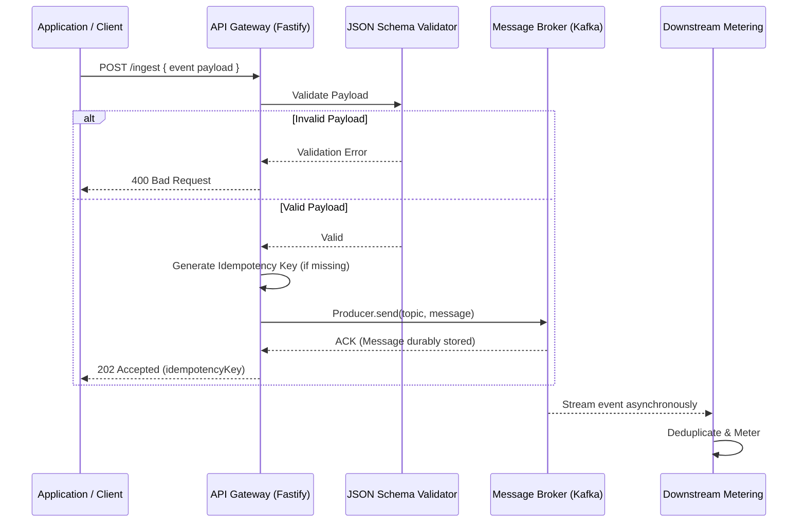

### 6.5 Implementation Blueprint
A typical Fastify ingestion route integrated with Kafka:

```javascript
// Example Fastify route publishing to Kafka
fastify.post('/ingest', { schema: eventSchema }, async (request, reply) => {
    const eventPayload = request.body;
    
    // Produce event to Kafka topic
    await kafkaProducer.send({
        topic: 'usage-events',
        messages: [
            { key: eventPayload.customerId, value: JSON.stringify(eventPayload) }
        ],
    });
    
    // Acknowledge receipt immediately
    return reply.code(202).send({ status: 'accepted' });
});
```

### 6.6 Class Diagram
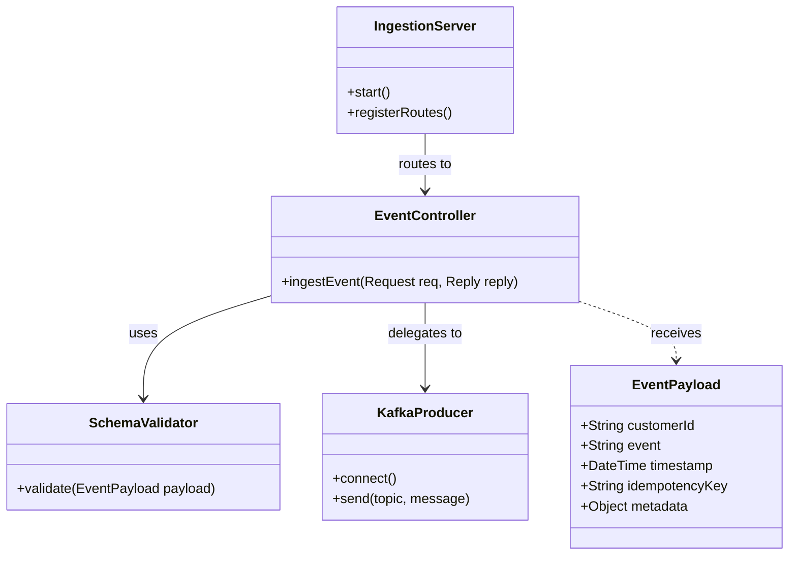

### 6.7 Deployment Diagram
```mermaid
flowchart TD
    subgraph K8s Cluster [Kubernetes Cluster]
        subgraph Ingestion Pods
            App1[Fastify Server 1]
            App2[Fastify Server 2]
        end
        ALB[Load Balancer] --> App1
        ALB --> App2
    end
    
    subgraph Kafka Cluster [Managed Kafka (MSK / Confluent)]
        K1[(Broker 1)]
        K2[(Broker 2)]
    end
    
    App1 -->|Produce| K1
    App2 -->|Produce| K2
```

### 6.8 Data Model
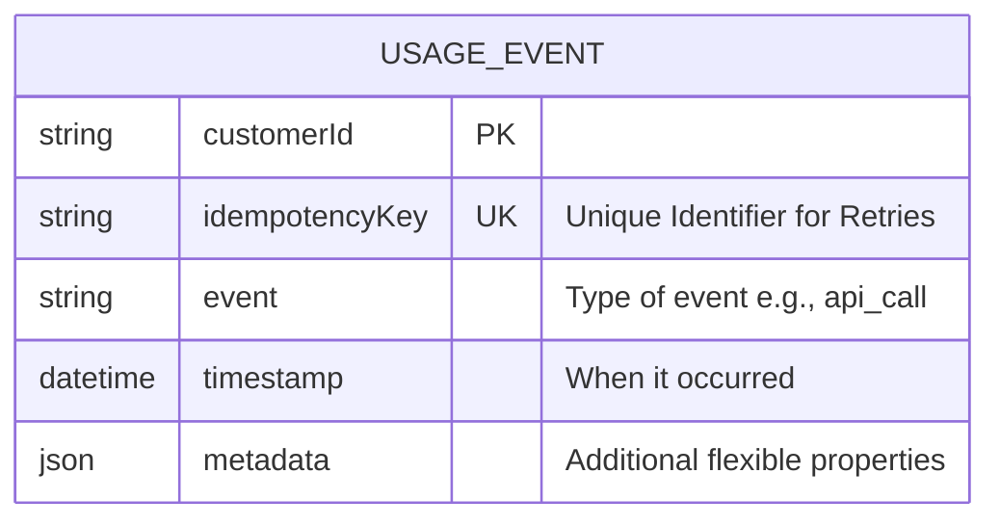

## 7. Implementation Details: Mediation and Metering Layer

### 7.1 Overview
The **Mediation and Metering Layer** is a Python-based processing engine that consumes raw events from Kafka. It ensures exactly-once semantics by deduplicating events using Redis and maintains high-speed counters for real-time usage tracking before data is eventually persisted into the Data Warehouse.

### 7.2 Sequence Diagram
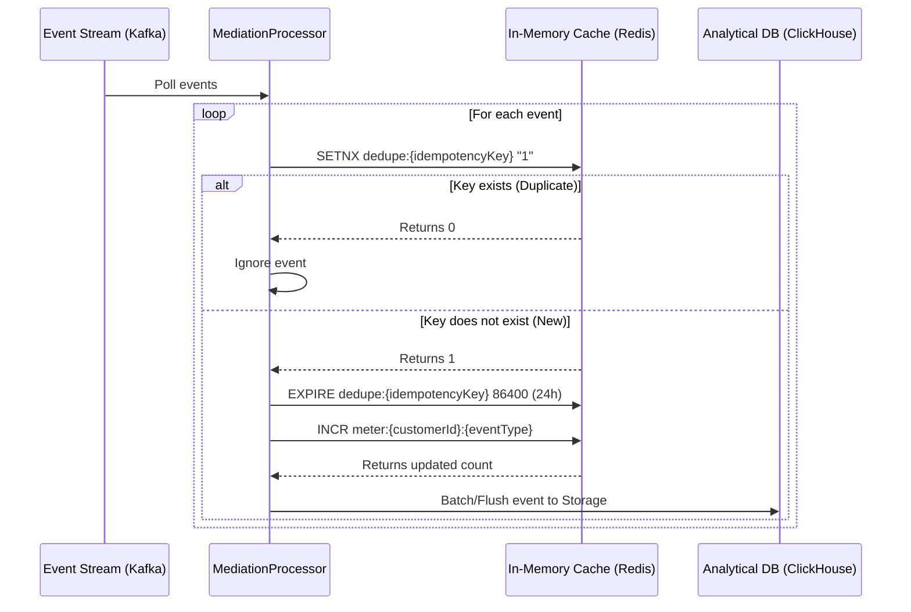

### 7.3 Class Diagram
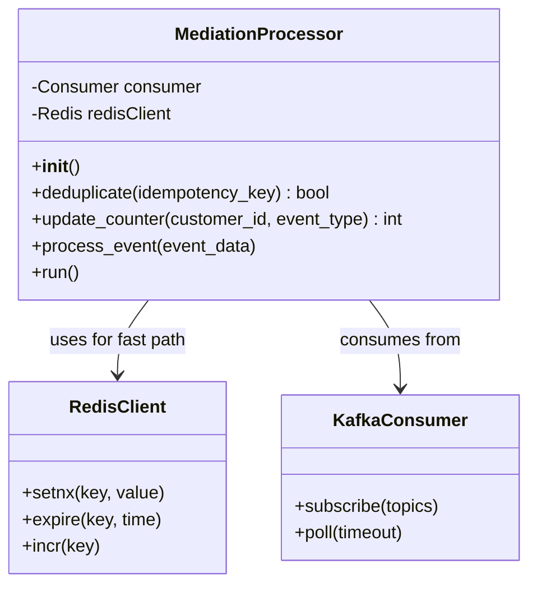

### 7.4 Deployment Diagram
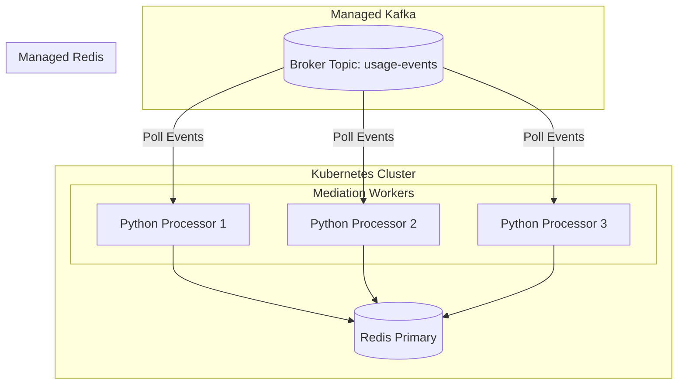

### 7.5 Data Model
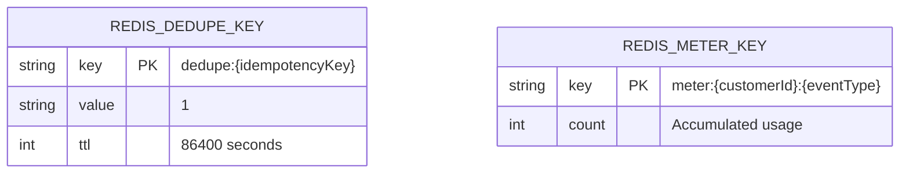

## 8. Implementation Details: Storage and Data Lakehouse

### 8.1 Overview
The **Storage and Data Lakehouse Layer** bridges the gap between raw streaming events and queryable analytical data. It consumes events from Kafka, uploading immutable raw JSON payloads to an **S3 Data Lake** for long-term auditing, while simultaneously upserting structured records into **ClickHouse** for high-speed, aggregative queries by the Rating system.

### 8.2 Sequence Diagram
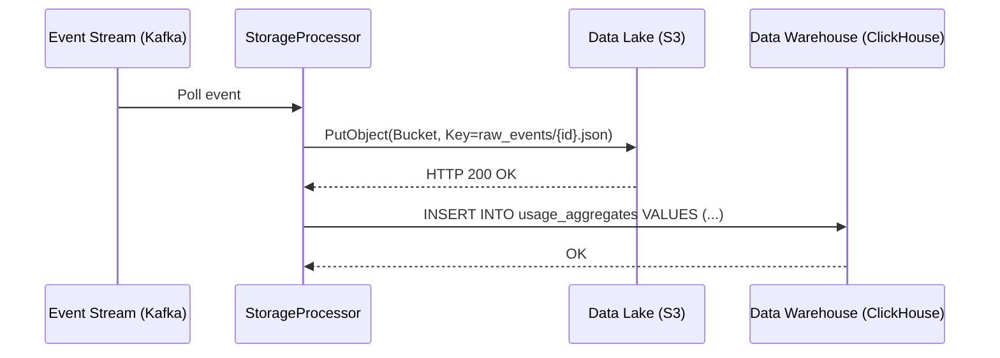

### 8.3 Class Diagram
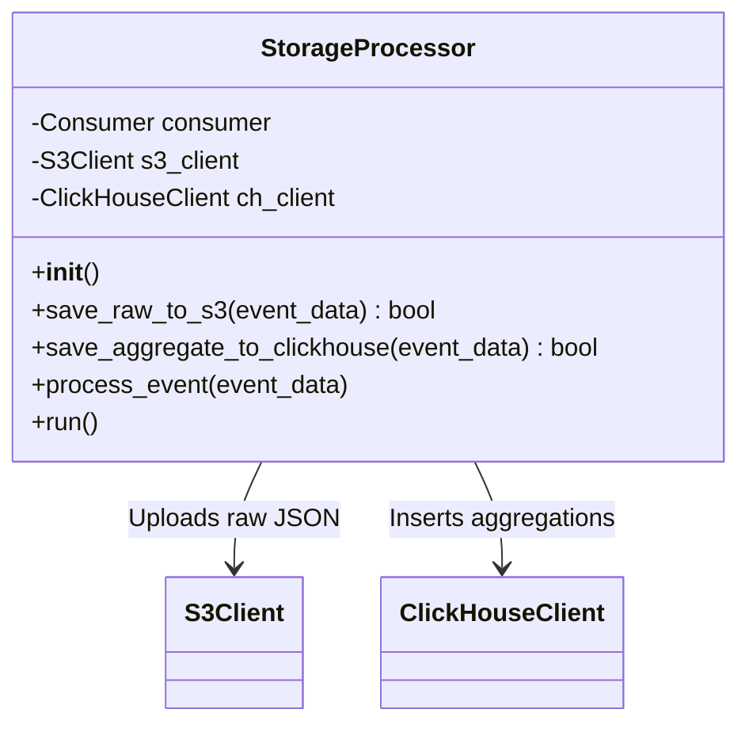

### 8.4 Deployment Diagram
```mermaid
flowchart TD
    subgraph Storage Tier (K8s)
        S1[Python Storage Sink 1]
        S2[Python Storage Sink 2]
    end
    
    subgraph Kafka Cluster [Managed Kafka]
        K[(Broker Topic: usage-events)]
    end
    
    subgraph AWS Cloud
        S3[(Amazon S3 / Data Lake)]
    end
    
    subgraph Analytics Tier
        CH[(ClickHouse Cluster)]
    end
    
    K -->|Poll Events| S1
    K -->|Poll Events| S2
    
    S1 -->|PutObject| S3
    S2 -->|PutObject| S3
    
    S1 -->|Insert Batch| CH
    S2 -->|Insert Batch| CH
```

### 8.5 Data Model
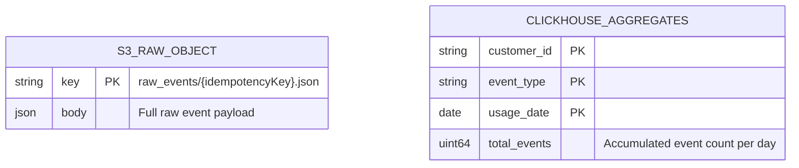

## 9. Implementation Details: Rating and Revenue System

### 9.1 Overview
The **Rating and Revenue System** operates asynchronously, responding to billing triggers (e.g., end-of-month processes) published to Kafka. It reaches out to **ClickHouse** to retrieve aggregated usage data, calculates charges against a pricing catalog, and outputs finalized invoice documents to an **S3 Bucket**.

### 9.2 Sequence Diagram
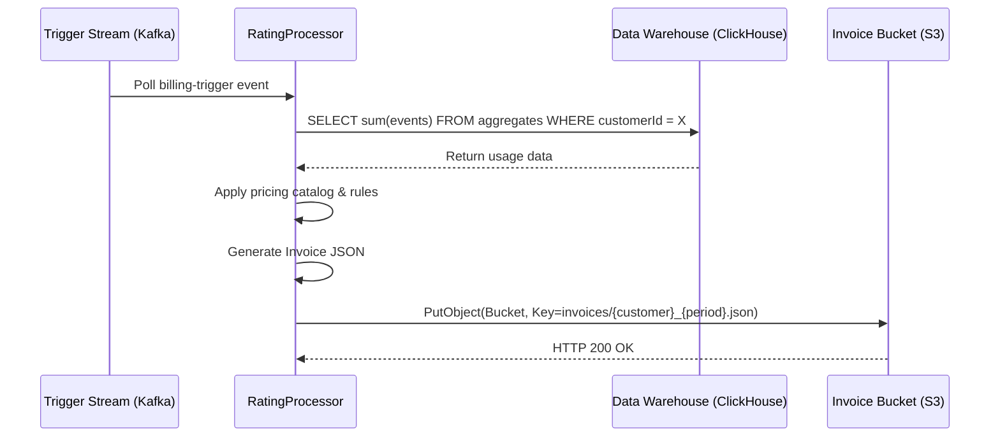

### 9.3 Class Diagram
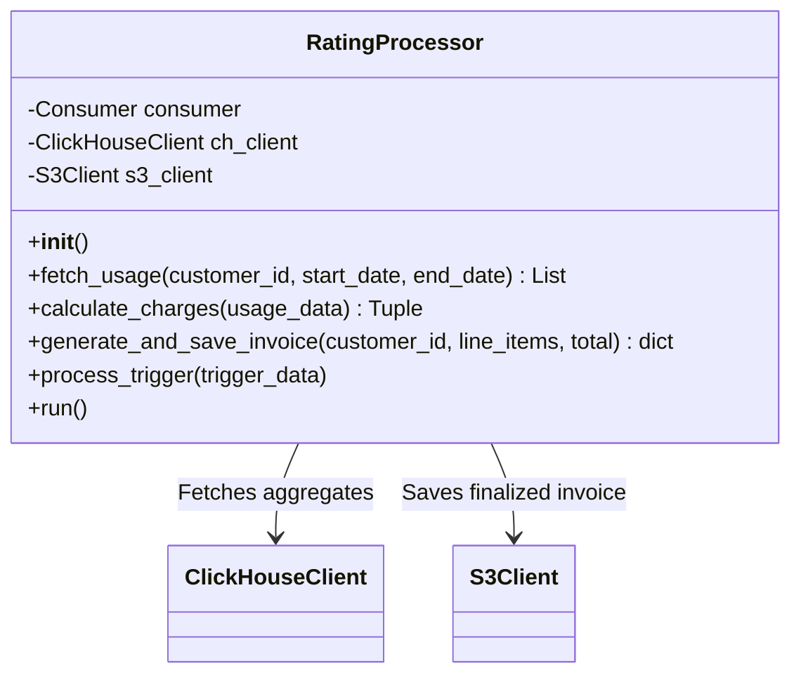

### 9.4 Deployment Diagram
```mermaid
flowchart TD
    subgraph Rating Tier (K8s / CronJob)
        R1[Rating Processor 1]
    end
    
    subgraph Kafka Cluster [Managed Kafka]
        K[(Topic: billing-triggers)]
    end
    
    subgraph Analytics Tier
        CH[(ClickHouse Cluster)]
    end
    
    subgraph AWS Cloud
        S3[(Amazon S3 / Invoices)]
    end
    
    K -->|Trigger Signal| R1
    R1 -->|Query Data| CH
    R1 -->|Write Invoice| S3
```

### 9.5 Data Model
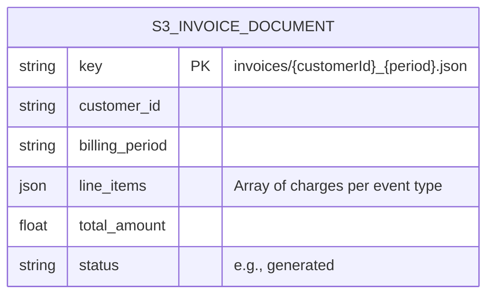
